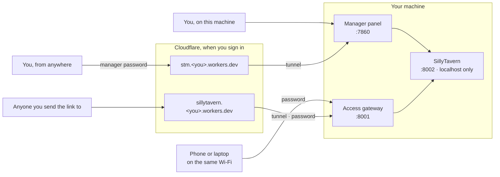

<div align="center">


# SillyTavern Manager

**One control panel that installs, runs, shares, backs up and watches [SillyTavern](https://github.com/SillyTavern/SillyTavern) — on Windows, Android, macOS, Linux and Docker.**

[](https://github.com/locmaymo/stm/releases/latest)
[](https://www.npmjs.com/package/sillytavern-manager)
[](https://github.com/locmaymo/stm/actions/workflows/verify.yml)
[](https://github.com/locmaymo/stm/releases)
[](https://www.npmjs.com/package/sillytavern-manager)
[](https://nodejs.org)
[](LICENSE)

[Website](https://stm.phamloc.top) ·
[Documentation](https://stm.phamloc.top/docs) ·
[Download](https://github.com/locmaymo/stm/releases/latest) ·
[npm](https://www.npmjs.com/package/sillytavern-manager) ·
[Quick start](#quick-start) ·
[Screenshots](#screenshots) ·
[How it works](#how-it-works) ·
[Backups](#backup-and-restore) ·
[Tiếng Việt](README.vi.md)

<picture>
  <source media="(prefers-color-scheme: dark)" srcset=".github/screenshots/en/overview-dark.webp">
  
</picture>

</div>

---

## What it does

SillyTavern is a terminal, a Git checkout and a folder of data you must not lose. SillyTavern Manager turns all three into a page you can open from any device.

| | |
| --- | --- |
| **Install and update** | Pick a release or a branch and press **Install**. The manager clones it, installs dependencies, health-checks the build and reports **Ready** only once SillyTavern answers on its port. It tells you when a newer release is out. |
| **Run and watch** | Start, stop and open SillyTavern from the panel, with live logs from the manager, SillyTavern, the installer, backups and the tunnel in one searchable feed. |
| **Share safely** | SillyTavern itself stays on localhost. Other devices and Cloudflare Tunnel reach it through the manager's access gateway, which asks for a password first and never forwards the admin panel. |
| **A link that keeps working** | Sign in to Cloudflare and the manager puts `sillytavern.<you>.workers.dev` and `stm.<you>.workers.dev` in front of the tunnels. A Quick Tunnel's own hostname changes every restart; these two never do. |
| **Reach your own machine** | The console has its own link, behind the manager password, for administering the machine from somewhere else. It is a separate switch from the one you share. |
| **Back up** | Scheduled and manual ZIP archives, compatible with SillyTavern's own exports, plus previewed restores and a safety snapshot before anything is replaced. |
| **Back up off-site** | One button signs in to Cloudflare, finds or creates an R2 bucket and keeps recovery points there. No keys to create or paste — or bring your own S3 keys. |
| **Know your usage** | Requests, tokens, cache hits and latency per day, per provider and per model, measured from SillyTavern's own traffic. |
| **Keep data separate** | Named profiles for separate SillyTavern data sets, switched from the panel, each with its own backups. |
| **Speak your language** | English and Vietnamese, light and dark, desktop and phone. |

## Quick start

| Platform | Start here |
| --- | --- |
| **Windows** | [Download the portable ZIP](#windows) — nothing to install |
| **Android** | [Copy the Termux commands](#android-termux) |
| **macOS** | [Install from source](#macos) |
| **Linux / VPS** | [Run the Unix launcher](#linux-and-vps) |
| **Docker / hosted** | [Build and run the image](#docker-and-hosted-platforms) |
| **npm** | [Use the package](#npm) |

Whichever you choose, the first visit asks you to create one manager administrator password. Then pick a SillyTavern version and press **Install**.

<details id="windows">
<summary><b>Windows — download and run</b></summary>

<br>

1. Open the [latest GitHub release](https://github.com/locmaymo/stm/releases/latest).
2. Download `SillyTavernManager-windows-x64-vX.Y.Z.zip` and its `.sha256` checksum file.
3. Extract the ZIP to a normal folder, such as `Downloads\SillyTavernManager`.
4. Double-click `SillyTavernManager.exe`.
5. Open `http://127.0.0.1:7860` if the browser does not open by itself.

A console window opens and stays open. That window is the manager: it shows the address, where your data is kept, and what the manager and SillyTavern are doing. To stop everything, press <kbd>Q</kbd> or <kbd>Ctrl</kbd>+<kbd>C</kbd> in it, or close it — SillyTavern and the Cloudflare tunnel are shut down with it, so no port is left held and there is no process to hunt for in Task Manager. Press <kbd>O</kbd> to open the panel in your browser again.

If the manager fails to start, the window keeps the reason on screen and waits for <kbd>Enter</kbd> rather than closing. Starting a second copy while one is already running says so and opens the running one instead.

The portable bundle already contains Node.js, the manager server, the panel and production dependencies. Nothing needs a terminal. The application folder and the data folder stay separate, so replacing the ZIP never touches your data:

```text
%LOCALAPPDATA%\SillyTavernManager
```

</details>

<details id="android-termux">
<summary><b>Android — Termux, copy and paste</b></summary>

<br>

Install [Termux from F-Droid](https://f-droid.org/packages/com.termux/) or another trusted source. Do not use the old Play Store build. Open Termux and paste these commands one block at a time:

```bash
pkg update -y
pkg upgrade -y
pkg install -y git nodejs-lts
git clone https://github.com/locmaymo/stm.git
cd stm
npm ci
npm start
```

Leave that Termux session running while SillyTavern is in use. Open the manager on the phone at `http://127.0.0.1:7860`; SillyTavern itself is at `http://127.0.0.1:8002`. The manager can create a public tunnel when you want to reach SillyTavern from an iPhone or another network.

Later starts:

```bash
cd "$HOME/stm"
npm start
```

Updates, after stopping the running manager:

```bash
cd "$HOME/stm"
git pull --ff-only
npm ci
npm start
```

Termux data is stored outside the repository at `$PREFIX/var/sillytavern-manager`, so it survives `git pull` and application updates.

Cloudflared is optional; local access keeps working when a tunnel is not installed or is offline. Turning the tunnel on in Termux needs nothing installed by hand: Android starts position-independent executables only and Cloudflare's own builds are not, so the manager asks Termux for its build of cloudflared and, failing that, runs Cloudflare's through `proot`, installing whichever of the two it ends up needing.

</details>

<details id="macos">
<summary><b>macOS — install from source</b></summary>

<br>

macOS uses the same Node.js launcher as Linux. Install Homebrew and Node.js 22 or newer, then copy these commands into Terminal:

```bash
/bin/bash -c "$(curl -fsSL https://raw.githubusercontent.com/Homebrew/install/HEAD/install.sh)"
brew install git node
git clone https://github.com/locmaymo/stm.git
cd stm
npm ci
node deploy/linux/launcher.mjs
```

Open `http://127.0.0.1:7860`. SillyTavern remains at `http://127.0.0.1:8002`. Stop the process with <kbd>Ctrl</kbd>+<kbd>C</kbd>, and start it again later with:

```bash
cd "$HOME/stm"
node deploy/linux/launcher.mjs
```

Data is kept under `~/.local/share/sillytavern-manager`.

</details>

<details id="linux-and-vps">
<summary><b>Linux and VPS</b></summary>

<br>

Install Node.js 22 or newer, then run:

```bash
git clone https://github.com/locmaymo/stm.git
cd stm
npm ci
node deploy/linux/launcher.mjs
```

Data is stored under `$XDG_DATA_HOME/sillytavern-manager`, or `~/.local/share/sillytavern-manager` when that variable is unset.

Keep port `7860` behind the VPS firewall or platform access control. Expose SillyTavern through the tunnel or the access gateway instead of publishing the manager panel.

</details>

<details id="docker-and-hosted-platforms">
<summary><b>Docker and hosted platforms</b></summary>

<br>

Build the image from the repository:

```bash
git clone https://github.com/locmaymo/stm.git
cd stm
docker build -f deploy/docker/Dockerfile -t sillytavern-manager .
```

Run it with durable storage:

```bash
docker run --rm \
  -p 7860:7860 \
  -v sillytavern-manager-data:/data \
  -e STM_ADMIN_PASSWORD='choose-a-long-password' \
  sillytavern-manager
```

Open the manager at `http://127.0.0.1:7860`. SillyTavern stays on the container's internal port `8002`; a configured tunnel points only to that port.

For a hosted container platform, expose port `7860`, provide `STM_ADMIN_PASSWORD` through its secret settings and mount durable storage at `/data`. Never put the admin password in a Dockerfile or commit it to Git.

Hosted platforms often decide three things for you, and the manager now meets each of them without being configured.

**The port.** A platform that routes a single port from the outside world announces it in `PORT`; the manager listens there, so a repository imported into one works on the first run. A port the manager only *prefers* — its own `7860`, the access gateway's `8001`, SillyTavern's `8002` — steps aside to the next free one when something else on the machine already holds it, and writes down where it went. Set `STM_PORT` or `STM_ACCESS_PORT` to pin one deliberately; a pinned port is bound or the start fails, rather than moving.

**The network.** Where outbound UDP is blocked, cloudflared cannot reach Cloudflare's edge over QUIC, and a tunnel sits at *Registering tunnel* until the link times out with error 1033. The manager notices — from the error line, or from the silence — and comes back over HTTP/2, remembering the answer so the wait is paid once rather than at every restart. `STM_TUNNEL_PROTOCOL=http2` skips the discovery.

**The disk.** Some platforms give the container a filesystem that is made with the machine and thrown away with it, and stop the machine once it has been idle. The manager checks what its data directory is actually on, and says so in the log and on the data page: this machine does not keep your data, connect Cloudflare R2.

That last warning has a way out. Put the four `STM_R2_*` values in `.env` or in the platform's own environment settings, so they come back with the checkout rather than with the disk that was wiped. The manager then notices on the way up that the profile is empty and the bucket is not, and brings the newest recovery point back before SillyTavern starts. A profile that already holds something is never restored over.

</details>

<details id="npm">
<summary><b>npm (technical users)</b></summary>

<br>

The manager is published on npm as [`sillytavern-manager`](https://www.npmjs.com/package/sillytavern-manager). On a machine with Node.js 22 or newer:

```bash
npx sillytavern-manager
```

Or install it globally:

```bash
npm install --global sillytavern-manager
sillytavern-manager
```

Windows users should prefer the portable ZIP, because it already includes Node.js. The package and the source launcher use the same ports and data-directory rules.

</details>

### First setup

1. Open the manager at port `7860` and create the manager administrator password.
2. Choose a SillyTavern version — `latest` is selected by default.
3. Press **Install** and wait for **Ready**. Ready means SillyTavern answered on port `8002`.
4. Open the local link, or set the SillyTavern password and then turn on local-network access or a public tunnel.

The manager password and the SillyTavern password are two different things. The SillyTavern password is asked for by a sign-in page the manager serves, so it works the same on every SillyTavern version, old or new; changing it signs out every device that was already in.

## Screenshots

Every shot below follows your own system theme, light or dark.

<table>
<tr>
<td width="50%">
<picture>
  <source media="(prefers-color-scheme: dark)" srcset=".github/screenshots/en/data-dark.webp">
  
</picture>
</td>
<td width="50%">
<picture>
  <source media="(prefers-color-scheme: dark)" srcset=".github/screenshots/en/metrics-dark.webp">
  
</picture>
</td>
</tr>
<tr>
<td><b>Data</b> — profiles, scheduled and manual backups, Cloudflare R2 in one page.</td>
<td><b>Metrics</b> — requests, tokens, cache hits and latency, per day, provider and model.</td>
</tr>
<tr>
<td>
<picture>
  <source media="(prefers-color-scheme: dark)" srcset=".github/screenshots/en/settings-dark.webp">
  
</picture>
</td>
<td>
<picture>
  <source media="(prefers-color-scheme: dark)" srcset=".github/screenshots/en/sign-in-dark.webp">
  
</picture>
</td>
</tr>
<tr>
<td><b>Settings</b> — passwords, and SillyTavern's own <code>config.yaml</code> as plain switches.</td>
<td><b>Sign in</b> — one password opens the manager, and only the manager.</td>
</tr>
</table>

<div align="center">
<picture>
  <source media="(prefers-color-scheme: dark)" srcset=".github/screenshots/en/mobile-dark.webp">
  
</picture>
<p><b>On a phone</b> — the same panel, with the navigation moved to the bottom.</p>
</div>

## How it works

Three ports, and only one of them is ever shared:



| Port | What listens | Who can reach it |
| --- | --- | --- |
| `7860` | The manager panel | This machine, and you from anywhere once you switch its own link on |
| `8002` | SillyTavern | This machine only |
| `8001` | The access gateway | Your local network or a Cloudflare Tunnel, after a password |

Two separate switches, because the two links are given to different people. **Cloudflare tunnel** on the overview opens the gateway, which asks for the SillyTavern password and never forwards the admin panel — that is the link you send to somebody you want to chat with. **Open this manager to the internet**, in **Settings**, opens the console itself behind the manager password; it is for reaching your own machine from another one, not for sharing.

### Addresses that do not change

A Cloudflare Quick Tunnel gets a random hostname, and a different one every time it starts — so a link saved yesterday is a dead name today, and a phone that had it bookmarked gets `DNS_PROBE_FINISHED_NXDOMAIN` rather than a page that says to try later.

Sign in to Cloudflare (the same sign-in that sets up backups) and the manager puts two small Workers on your account's own `workers.dev` subdomain: `sillytavern.<you>.workers.dev` in front of SillyTavern and `stm.<you>.workers.dev` in front of the console. They forward to whichever tunnel is running and are redeployed the moment it changes, so the address you write down, bookmark or send is yours for good. While the machine is off they answer with a short page saying so.

The manager will not deploy over a Worker of those names that it did not create, so an account that already has one keeps it — the panel says so instead. Disconnecting Cloudflare removes both.

Where your data lives:

| Platform | Data directory |
| --- | --- |
| Windows | `%LOCALAPPDATA%\SillyTavernManager` |
| macOS and Linux | `$XDG_DATA_HOME/sillytavern-manager`, else `~/.local/share/sillytavern-manager` |
| Termux | `$PREFIX/var/sillytavern-manager` |
| Docker | `/data` (mount it) |

The directory holds profiles, backups, logs, metrics and the telemetry outbox. It is never inside the application folder, so updating the application never touches it.

## Backup and restore

Local backup is always available. The archive is a streaming ZIP compatible with SillyTavern exports. By default it excludes `secrets.json`, thumbnails, vectors, generated backups, `.git`, `node_modules` and operating-system metadata. Including secrets is an explicit action with a warning.

Restore previews the archive before writing. Replace is the default mode; merge is available when needed. A safety snapshot is created before a replace or a profile switch.

### Cloudflare R2

On the **Data** page, **Where backups go** is the one question, and **Connect Cloudflare** is the one step in answering it. Sign in to Cloudflare, pick the account, allow the permissions, and the manager finds or creates a bucket named `sillytavern-manager-backup` in that account and starts backing up to it. There are no keys to create or paste.

If the account has never enabled R2, Cloudflare refuses to make the bucket however many permissions were granted, and the panel says so with a link to the page that turns it on. R2 has to be enabled once in the Cloudflare dashboard and Cloudflare asks for a card before it will; the first 10 GB stay free and nothing is charged until you pass the free tier.

- **Allow Workers** (optional, recommended). The manager deploys a small Worker, also named `sillytavern-manager-backup`, that carries backup data to the bucket. It is fast and does not use your Cloudflare API rate limit. Without it, backups go through Cloudflare's API, which is slower, and a first backup can take a long time.
- **Allow Account Analytics** (optional). The panel then shows storage and Class A/B operations as Cloudflare counts them, for the backup bucket and for the whole account against the free tier. These are usage figures, not your bill.
- **A new machine** connects to the same account and finds the same bucket; the recovery points already in it can be brought back and restored.
- **Disconnect** removes this installation's Worker key and revokes the sign-in. The bucket and its recovery points stay in your account. You can also revoke access at any time under **Manage OAuth authorizations** in your Cloudflare profile.
- **Check** reads the bucket once and says what is in it - how many objects, how large, how many recovery points - and brings the panel's own figures back in line with it. It is the one button for "does this work": there is nothing else to press to find out.

The recovery points shown are every one in the bucket, not only this machine's. A profile is identified by a name the machine that made it chose, so a machine set up today has one the bucket has never seen; listing only its own would show an empty table over a bucket holding a year of backups. Points written by another machine are marked, and bringing one back works the same way.

Only the Cloudflare refresh token is stored, in its own file readable by your user alone. Worker keys live in memory, change every day, and each installation has its own.

**S3 keys instead.** If you would rather not sign in, open **Where backups go**, choose **R2 or S3 keys** and enter the endpoint, bucket and key pair from the R2 page of the Cloudflare dashboard, or set them in `.env` (see [`.env.example`](.env.example)). Any S3-compatible storage works this way. Both ways of reaching a bucket are in that one form; saving is choosing which one carries the backups.

## Configuration

Everything can be set in the panel. These environment variables, read from the process or from a `.env` file at start, are for unattended installs; anything set here is shown in the panel and cannot be changed there.

| Variable | What it does |
| --- | --- |
| `STM_ADMIN_PASSWORD` | Creates the manager administrator password at first start, for Docker and hosted platforms |
| `STM_R2_ENDPOINT` | R2 or S3 endpoint, `https://<account-id>.r2.cloudflarestorage.com` |
| `STM_R2_BUCKET` | Bucket name |
| `STM_R2_ACCESS_KEY_ID` | Access key ID |
| `STM_R2_SECRET_ACCESS_KEY` | Secret access key |
| `STM_CLOUDFLARE_OAUTH_CLIENT_ID` | Use an OAuth client registered in your own Cloudflare account; empty turns signing in off and leaves S3 keys |
| `STM_CLOUDFLARE_OAUTH_REDIRECT_URI` | Redirect URI of your own relay page (see [`deploy/oauth-relay`](deploy/oauth-relay)) |
| `STM_CLOUDFLARE_OAUTH_SCOPES` | Scopes requested at sign-in |

With all four `STM_R2_*` values set, R2 backups are switched on the first time the manager starts.

## Terms, disclaimer and privacy

The project's [Terms of Use](https://stm.phamloc.top/terms), [Disclaimer](https://stm.phamloc.top/disclaimer), [Privacy Notice](https://stm.phamloc.top/privacy) and [Notices](https://stm.phamloc.top/notices) are published on the site and ship inside the application: the first-run screen opens them from the line beside the tick, and **Settings → About** opens them again afterwards. The text lives once, in [`packages/legal`](packages/legal), and everything that shows it is a view of that file.

In short: this project is not affiliated with SillyTavern; it clones the public repository onto your machine at your request. It operates no service, holds no copy of your data, and has nothing to moderate. Cloudflare resources and the charges they carry are yours, in your own account. Backups are a tool rather than a promise.

### Telemetry

Telemetry is part of this free project. The manager sends only an allowlisted summary: platform, application version, provider, model, endpoint hostname, streaming flag, max tokens, input/output/total tokens, cache usage, reasoning-token usage, status and duration.

It does **not** send API keys, authorization headers, prompts, chats, model responses, request bodies, response bodies, request logs, file names, file paths, IP addresses or URL query strings. Events are written to a local outbox first and sent asynchronously, so a receiver outage never blocks SillyTavern.

## Updating

| Platform | How |
| --- | --- |
| Windows | Stop the old manager, extract the new ZIP into a new folder, run the new executable. Keep the old folder for rollback. |
| Termux, macOS, Linux | Stop the process, then `git pull --ff-only`, `npm ci`, and start the launcher again. |
| Docker | Rebuild the image and start a new container against the same volume. |

The platform data directory is preserved either way, so profiles, backups, logs, metrics and settings remain.

Release builds are generated from version tags: GitHub Actions verifies the project, creates the Windows ZIP and checksum, builds the Docker image and creates the npm tarball.

## Development

Requirements: Node.js 22+, npm 11+, and PowerShell 7+ for Windows packaging.

```bash
npm ci
npm run panel:dev      # the panel, with hot reload
npm run manager:start  # the manager server
```

Run the repository checks before opening a pull request:

```bash
npm run verify         # encoding gate, lint, typecheck, tests
```

Build release artifacts locally on Windows:

```powershell
pwsh packaging/windows/package-release.ps1
npm run release:npm
```

### Repository layout

| Path | What lives there |
| --- | --- |
| `apps/manager-server` | HTTP API, sessions, access gateway, job runner |
| `apps/manager-panel` | The React panel served at port `7860` |
| `packages/sillytavern-runtime` | Installing, updating and running SillyTavern |
| `packages/backup` · `packages/r2` | ZIP archives and restores · R2 and S3 transfers |
| `packages/cloudflare` · `packages/tunnel` | Cloudflare sign-in, Workers and usage · cloudflared |
| `packages/profiles` · `packages/config` | Data profiles · `config.yaml` the panel can edit |
| `packages/instrumentation` · `packages/telemetry` | Usage capture · the outbox that sends summaries |
| `packages/platform` · `packages/contracts` · `packages/ui` | Per-OS paths · shared types · components and locales |
| `deploy/` · `packaging/` | Docker, Linux, Termux, OAuth relay · Windows release |

Contributions are welcome. Please read [`AGENTS.md`](AGENTS.md) first: repository text is UTF-8 without BOM and NFC-normalized, English is the canonical locale, Vietnamese translations are additive only, and `npm run verify` has to pass.

## License

Copyright (C) 2026 locmaymo

SillyTavern Manager is free software: you can redistribute it and/or modify it under the terms of the [GNU Affero General Public License version 3](LICENSE) (AGPL-3.0-only) as published by the Free Software Foundation.

This license applies to every version of the project, including all commits and releases published before the `LICENSE` file was added, such as v0.1.0.

Third-party code keeps its own license; see [THIRD_PARTY_NOTICES.md](THIRD_PARTY_NOTICES.md). The SillyTavern Vietnam (STVN) logo and the third-party logos described there are not covered by the AGPL-3.0.
