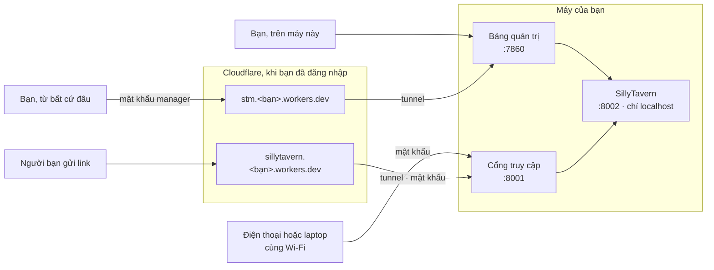

<div align="center">


# SillyTavern Manager

**Một bảng điều khiển để cài đặt, chạy, chia sẻ, sao lưu và theo dõi [SillyTavern](https://github.com/SillyTavern/SillyTavern) — trên Windows, Android, macOS, Linux và Docker.**

[](https://github.com/locmaymo/stm/releases/latest)
[](https://www.npmjs.com/package/sillytavern-manager)
[](https://github.com/locmaymo/stm/actions/workflows/verify.yml)
[](https://github.com/locmaymo/stm/releases)
[](https://www.npmjs.com/package/sillytavern-manager)
[](https://nodejs.org)
[](LICENSE)

[Trang web](https://stm.phamloc.top/vi/) ·
[Tài liệu](https://stm.phamloc.top/vi/docs) ·
[Tải về](https://github.com/locmaymo/stm/releases/latest) ·
[npm](https://www.npmjs.com/package/sillytavern-manager) ·
[Bắt đầu nhanh](#bắt-đầu-nhanh) ·
[Ảnh màn hình](#ảnh-màn-hình) ·
[Cách hoạt động](#cách-hoạt-động) ·
[Sao lưu](#sao-lưu-và-khôi-phục) ·
[English](README.md)

<picture>
  <source media="(prefers-color-scheme: dark)" srcset=".github/screenshots/vi/overview-dark.webp">
  
</picture>

</div>

---

## Manager làm được gì

SillyTavern là một cửa sổ terminal, một bản checkout Git và một thư mục dữ liệu bạn không được phép mất. SillyTavern Manager biến cả ba thành một trang web mà bạn mở được từ bất kỳ thiết bị nào.

| | |
| --- | --- |
| **Cài đặt và cập nhật** | Chọn một bản release hoặc một branch rồi bấm **Cài đặt**. Manager tự clone, cài dependency, kiểm tra bản cài và chỉ báo **Ready** khi SillyTavern thực sự trả lời trên cổng của nó. Có bản mới, manager sẽ báo. |
| **Chạy và theo dõi** | Bật, tắt và mở SillyTavern ngay trong panel, cùng log trực tiếp của manager, SillyTavern, trình cài đặt, sao lưu và tunnel trong một dòng tin tìm kiếm được. |
| **Chia sẻ an toàn** | Bản thân SillyTavern chỉ nằm ở localhost. Thiết bị khác và Cloudflare Tunnel đi qua cổng truy cập của manager, cổng đó hỏi mật khẩu trước và không bao giờ chuyển tiếp bảng quản trị. |
| **Link dùng được lâu dài** | Đăng nhập Cloudflare là manager đặt `sillytavern.<bạn>.workers.dev` và `stm.<bạn>.workers.dev` đứng trước tunnel. Hostname của Quick Tunnel đổi sau mỗi lần khởi động lại; hai địa chỉ này thì không. |
| **Vào máy của mình từ xa** | Console có link riêng, nằm sau mật khẩu manager, để bạn quản trị máy từ nơi khác. Đó là một công tắc tách biệt với cái link bạn chia sẻ. |
| **Sao lưu** | Archive ZIP theo lịch hoặc thủ công, tương thích với export của chính SillyTavern, kèm xem trước khi khôi phục và một safety snapshot trước khi ghi đè. |
| **Sao lưu ngoài máy** | Một nút đăng nhập Cloudflare, tìm hoặc tạo bucket R2 và giữ các điểm khôi phục ở đó. Không phải tạo hay dán khoá nào — hoặc dùng khoá S3 của bạn. |
| **Biết mình dùng bao nhiêu** | Số request, token, cache hit và độ trễ theo ngày, theo provider và theo model, đo từ chính lưu lượng của SillyTavern. |
| **Tách dữ liệu** | Nhiều profile cho nhiều bộ dữ liệu SillyTavern, chuyển ngay trong panel, mỗi profile có bản sao lưu riêng. |
| **Ngôn ngữ của bạn** | Tiếng Việt và tiếng Anh, giao diện sáng và tối, máy tính và điện thoại. |

## Bắt đầu nhanh

| Nền tảng | Bắt đầu tại đây |
| --- | --- |
| **Windows** | [Tải ZIP portable](#windows) — không phải cài gì |
| **Android** | [Copy các lệnh Termux](#android-termux) |
| **macOS** | [Cài từ source](#macos) |
| **Linux / VPS** | [Chạy launcher Unix](#linux-và-vps) |
| **Docker / cloud** | [Build và chạy image](#docker-và-nền-tảng-cloud) |
| **npm** | [Dùng package](#npm) |

Dù chọn cách nào, lần mở đầu tiên manager sẽ yêu cầu bạn tạo một mật khẩu quản trị. Sau đó chọn phiên bản SillyTavern và bấm **Cài đặt**.

<details id="windows">
<summary><b>Windows — tải và chạy</b></summary>

<br>

1. Mở [bản phát hành GitHub mới nhất](https://github.com/locmaymo/stm/releases/latest).
2. Tải `SillyTavernManager-windows-x64-vX.Y.Z.zip` cùng file checksum `.sha256`.
3. Giải nén ZIP vào một thư mục bình thường, ví dụ `Downloads\SillyTavernManager`.
4. Bấm đúp `SillyTavernManager.exe`.
5. Nếu trình duyệt không tự mở, truy cập `http://127.0.0.1:7860`.

Một cửa sổ console sẽ mở ra và ở nguyên đó. Cửa sổ đó chính là trình quản lý: nó hiển thị địa chỉ truy cập, nơi lưu dữ liệu của bạn, và mọi việc trình quản lý cùng SillyTavern đang làm. Để dừng tất cả, bấm <kbd>Q</kbd> hoặc <kbd>Ctrl</kbd>+<kbd>C</kbd> trong cửa sổ đó, hoặc đóng nó — SillyTavern và Cloudflare tunnel sẽ tắt cùng, nên không còn cổng nào bị chiếm và bạn không phải đi tìm tiến trình trong Task Manager. Bấm <kbd>O</kbd> để mở lại panel trong trình duyệt.

Nếu trình quản lý không khởi động được, cửa sổ sẽ giữ nguyên lý do trên màn hình và chờ bạn bấm <kbd>Enter</kbd> thay vì tự đóng. Nếu bạn mở bản thứ hai trong khi một bản đang chạy, nó sẽ báo cho bạn biết và mở bản đang chạy.

ZIP portable đã gồm Node.js, server manager, giao diện và dependency production. Bạn không cần cài gì bằng terminal. Thư mục ứng dụng và thư mục dữ liệu tách riêng, nên thay ZIP không bao giờ đụng tới dữ liệu:

```text
%LOCALAPPDATA%\SillyTavernManager
```

</details>

<details id="android-termux">
<summary><b>Android — Termux, copy và paste</b></summary>

<br>

Cài [Termux từ F-Droid](https://f-droid.org/packages/com.termux/) hoặc nguồn đáng tin cậy khác. Không dùng bản Termux cũ trên Play Store. Mở Termux và dán từng khối lệnh sau:

```bash
pkg update -y
pkg upgrade -y
pkg install -y git nodejs-lts
git clone https://github.com/locmaymo/stm.git
cd stm
npm ci
npm start
```

Giữ phiên Termux này chạy trong lúc dùng SillyTavern. Mở manager trên điện thoại tại `http://127.0.0.1:7860`; SillyTavern ở `http://127.0.0.1:8002`. Khi cần dùng iPhone hoặc mạng khác để truy cập, bạn có thể tạo public tunnel trong manager.

Lần sau khởi động lại:

```bash
cd "$HOME/stm"
npm start
```

Cập nhật, sau khi đã dừng manager:

```bash
cd "$HOME/stm"
git pull --ff-only
npm ci
npm start
```

Dữ liệu Termux nằm ngoài repository tại `$PREFIX/var/sillytavern-manager`, nên vẫn còn sau `git pull` và sau khi cập nhật ứng dụng.

Cloudflared là tùy chọn; truy cập local vẫn hoạt động khi tunnel chưa cài hoặc đang offline. Bật tunnel trên Termux không cần cài gì bằng tay: Android chỉ chạy tệp thực thi độc lập vị trí còn bản của Cloudflare thì không, nên trình quản lý xin bản cloudflared của Termux, nếu không được thì chạy bản của Cloudflare qua `proot`, và tự cài thứ mà nó cần.

</details>

<details id="macos">
<summary><b>macOS — cài từ source</b></summary>

<br>

macOS dùng chung launcher Node.js với Linux. Cài Homebrew và Node.js 22 trở lên, sau đó copy các lệnh này vào Terminal:

```bash
/bin/bash -c "$(curl -fsSL https://raw.githubusercontent.com/Homebrew/install/HEAD/install.sh)"
brew install git node
git clone https://github.com/locmaymo/stm.git
cd stm
npm ci
node deploy/linux/launcher.mjs
```

Mở `http://127.0.0.1:7860`. SillyTavern vẫn ở `http://127.0.0.1:8002`. Dừng bằng <kbd>Ctrl</kbd>+<kbd>C</kbd>, lần sau chạy lại bằng:

```bash
cd "$HOME/stm"
node deploy/linux/launcher.mjs
```

Dữ liệu được lưu tại `~/.local/share/sillytavern-manager`.

</details>

<details id="linux-và-vps">
<summary><b>Linux và VPS</b></summary>

<br>

Cài Node.js 22 trở lên rồi chạy:

```bash
git clone https://github.com/locmaymo/stm.git
cd stm
npm ci
node deploy/linux/launcher.mjs
```

Dữ liệu được lưu tại `$XDG_DATA_HOME/sillytavern-manager`, hoặc `~/.local/share/sillytavern-manager` nếu biến đó chưa đặt.

Hãy đặt cổng `7860` sau firewall hoặc access control của VPS. Mở SillyTavern qua tunnel hoặc cổng truy cập thay vì public bảng quản trị.

</details>

<details id="docker-và-nền-tảng-cloud">
<summary><b>Docker và nền tảng cloud</b></summary>

<br>

Clone repository rồi build image:

```bash
git clone https://github.com/locmaymo/stm.git
cd stm
docker build -f deploy/docker/Dockerfile -t sillytavern-manager .
```

Chạy với volume persistent:

```bash
docker run --rm \
  -p 7860:7860 \
  -v sillytavern-manager-data:/data \
  -e STM_ADMIN_PASSWORD='chon-mat-khau-dai' \
  sillytavern-manager
```

Mở manager tại `http://127.0.0.1:7860`. SillyTavern vẫn chạy ở cổng nội bộ `8002`; tunnel chỉ trỏ tới cổng đó.

Trên nền tảng cloud có container, mở cổng `7860`, đặt `STM_ADMIN_PASSWORD` bằng phần secret của nền tảng và mount lưu trữ persistent tại `/data`. Không đưa mật khẩu vào Dockerfile hoặc Git.

Hạ tầng cloud thường tự quyết ba thứ thay bạn, và trình quản lý giờ đáp ứng cả ba mà không cần cấu hình.

**Cổng.** Nền tảng chỉ định tuyến một cổng ra ngoài sẽ báo cổng đó qua biến `PORT`; trình quản lý lắng nghe ở đó, nên một repo vừa import vào là chạy được ngay từ lần đầu. Còn cổng mà trình quản lý chỉ *ưu tiên* — `7860` của chính nó, `8001` của cổng truy cập, `8002` của SillyTavern — nếu đã bị thứ khác trên máy chiếm thì nó tự nhường sang cổng trống kế tiếp và ghi lại số cổng mới. Muốn cố định thì đặt `STM_PORT` hoặc `STM_ACCESS_PORT`; cổng đã cố định sẽ được bind hoặc báo lỗi hẳn chứ không tự dời.

**Mạng.** Ở nơi UDP bị chặn đi ra, cloudflared không tới được biên của Cloudflare qua QUIC, và đường hầm cứ đứng ở *Registering tunnel* cho tới khi link báo lỗi 1033. Trình quản lý nhận ra điều đó — qua dòng lỗi, hoặc qua sự im lặng — rồi quay lại bằng HTTP/2 và ghi nhớ, nên chỉ phải chờ một lần chứ không phải mỗi lần khởi động. Đặt `STM_TUNNEL_PROTOCOL=http2` để bỏ qua bước dò.

**Ổ đĩa.** Một số nền tảng cấp cho container một hệ thống tệp sinh ra cùng máy và bị xóa cùng máy, và tắt máy sau một thời gian không dùng. Trình quản lý kiểm tra thư mục dữ liệu thực sự nằm trên loại ổ nào, rồi báo trong log và trên trang dữ liệu: máy này không giữ dữ liệu của bạn, hãy kết nối Cloudflare R2.

Cảnh báo cuối đó có lối thoát. Hãy đặt bốn giá trị `STM_R2_*` vào `.env` hoặc vào phần biến môi trường của nền tảng, để chúng quay lại cùng bản checkout chứ không mất theo ổ đĩa bị xóa. Khi đó, lúc khởi động trình quản lý sẽ nhận ra hồ sơ đang trống còn bucket thì không, và mang bản khôi phục mới nhất về trước khi SillyTavern chạy. Hồ sơ đã có dữ liệu thì không bao giờ bị ghi đè.

</details>

<details id="npm">
<summary><b>npm (người dùng kỹ thuật)</b></summary>

<br>

Manager đã có trên npm với tên [`sillytavern-manager`](https://www.npmjs.com/package/sillytavern-manager). Máy có Node.js 22 trở lên:

```bash
npx sillytavern-manager
```

Hoặc cài global:

```bash
npm install --global sillytavern-manager
sillytavern-manager
```

Người dùng Windows nên chọn ZIP portable vì ZIP đã có sẵn Node.js. Package và launcher source dùng cùng cổng và cùng quy tắc thư mục dữ liệu.

</details>

### Thiết lập lần đầu

1. Mở manager ở cổng `7860` và tạo mật khẩu quản trị.
2. Chọn phiên bản SillyTavern; mặc định là `latest`.
3. Bấm **Cài đặt** và chờ **Ready**. Ready nghĩa là SillyTavern đã trả lời ở cổng `8002`.
4. Mở link local, hoặc đặt mật khẩu SillyTavern rồi bật truy cập mạng nội bộ hay public tunnel.

Mật khẩu manager và mật khẩu SillyTavern là hai mật khẩu khác nhau. Mật khẩu SillyTavern được hỏi ở trang đăng nhập do chính manager phục vụ, nên nó hoạt động giống nhau trên mọi phiên bản SillyTavern, cũ hay mới; đổi mật khẩu sẽ đăng xuất mọi thiết bị đang ở trong.

## Ảnh màn hình

Mọi ảnh bên dưới đều tự đổi theo giao diện sáng hay tối của máy bạn.

<table>
<tr>
<td width="50%">
<picture>
  <source media="(prefers-color-scheme: dark)" srcset=".github/screenshots/vi/data-dark.webp">
  
</picture>
</td>
<td width="50%">
<picture>
  <source media="(prefers-color-scheme: dark)" srcset=".github/screenshots/vi/metrics-dark.webp">
  
</picture>
</td>
</tr>
<tr>
<td><b>Dữ liệu</b> — profile, sao lưu theo lịch và thủ công, Cloudflare R2 trong cùng một trang.</td>
<td><b>Số liệu</b> — request, token, cache hit và độ trễ theo ngày, theo provider và model.</td>
</tr>
<tr>
<td>
<picture>
  <source media="(prefers-color-scheme: dark)" srcset=".github/screenshots/vi/settings-dark.webp">
  
</picture>
</td>
<td>
<picture>
  <source media="(prefers-color-scheme: dark)" srcset=".github/screenshots/vi/sign-in-dark.webp">
  
</picture>
</td>
</tr>
<tr>
<td><b>Thiết lập</b> — mật khẩu, và <code>config.yaml</code> của SillyTavern dưới dạng công tắc.</td>
<td><b>Đăng nhập</b> — một mật khẩu mở manager, và chỉ mở manager.</td>
</tr>
</table>

<div align="center">
<picture>
  <source media="(prefers-color-scheme: dark)" srcset=".github/screenshots/vi/mobile-dark.webp">
  
</picture>
<p><b>Trên điện thoại</b> — vẫn panel đó, thanh điều hướng chuyển xuống dưới.</p>
</div>

## Cách hoạt động

Ba cổng, và chỉ một cổng được chia sẻ ra ngoài:



| Cổng | Cái gì đang lắng nghe | Ai vào được |
| --- | --- | --- |
| `7860` | Bảng quản trị manager | Máy này, và chính bạn từ xa khi đã bật link riêng của nó |
| `8002` | SillyTavern | Chỉ máy này |
| `8001` | Cổng truy cập | Mạng nội bộ hoặc Cloudflare Tunnel, sau khi nhập mật khẩu |

Hai công tắc tách riêng, vì hai cái link dành cho hai nhóm người khác nhau. **Cloudflare tunnel** ở trang tổng quan mở cổng truy cập — nó hỏi mật khẩu SillyTavern và không bao giờ chuyển tiếp bảng quản trị; đây là link bạn gửi cho người muốn chat cùng. **Mở trình quản lý này ra internet**, trong **Cài đặt**, mở chính console phía sau mật khẩu manager; nó để bạn quản trị máy của mình từ máy khác, không phải để chia sẻ.

### Địa chỉ không đổi

Cloudflare Quick Tunnel nhận một hostname ngẫu nhiên, và mỗi lần khởi động lại là một cái khác — nên cái link lưu hôm qua hôm nay đã là một cái tên chết, và điện thoại đã bookmark nó nhận `DNS_PROBE_FINISHED_NXDOMAIN` chứ không phải một trang báo hãy thử lại sau.

Đăng nhập Cloudflare (đúng cái đăng nhập dùng để sao lưu) và manager đặt hai Worker nhỏ lên subdomain `workers.dev` của chính tài khoản bạn: `sillytavern.<bạn>.workers.dev` đứng trước SillyTavern và `stm.<bạn>.workers.dev` đứng trước console. Chúng chuyển tiếp tới tunnel đang chạy và được deploy lại ngay khi tunnel đổi, nên địa chỉ bạn ghi lại, bookmark hay gửi đi là của bạn mãi mãi. Lúc máy tắt, chúng trả về một trang ngắn báo đúng như vậy.

Manager không deploy đè lên Worker trùng tên mà nó không tạo ra, nên tài khoản đã có sẵn một cái thì vẫn giữ nguyên — bảng điều khiển sẽ báo thay vì ghi đè. Ngắt kết nối Cloudflare sẽ xoá cả hai.

Dữ liệu của bạn nằm ở đâu:

| Nền tảng | Thư mục dữ liệu |
| --- | --- |
| Windows | `%LOCALAPPDATA%\SillyTavernManager` |
| macOS và Linux | `$XDG_DATA_HOME/sillytavern-manager`, nếu không thì `~/.local/share/sillytavern-manager` |
| Termux | `$PREFIX/var/sillytavern-manager` |
| Docker | `/data` (nhớ mount) |

Thư mục này chứa profile, backup, log, metrics và telemetry outbox. Nó không nằm trong thư mục ứng dụng, nên cập nhật ứng dụng không bao giờ đụng tới nó.

## Sao lưu và khôi phục

Backup local luôn hoạt động. Archive là ZIP streaming tương thích với export của SillyTavern. Mặc định loại `secrets.json`, thumbnail, vector, backup sinh tự động, `.git`, `node_modules` và metadata hệ điều hành. Đưa secrets vào backup là thao tác explicit kèm cảnh báo.

Restore cho xem trước trước khi ghi. Replace là chế độ mặc định, merge là tùy chọn. Manager tạo safety snapshot trước khi replace hoặc chuyển profile.

### Cloudflare R2

Ở trang **Data**, **Nơi lưu bản sao lưu** là câu hỏi duy nhất, và **Kết nối Cloudflare** là bước duy nhất để trả lời. Đăng nhập Cloudflare, chọn tài khoản, cho phép các quyền, manager sẽ tìm hoặc tạo bucket tên `sillytavern-manager-backup` trong tài khoản đó và bắt đầu sao lưu. Không cần tạo hay dán khoá nào.

Nếu tài khoản chưa từng bật R2, Cloudflare sẽ từ chối tạo bucket dù bạn đã cấp đủ quyền, và panel nói rõ điều đó kèm đường dẫn tới trang bật R2. R2 phải được bật một lần trong bảng điều khiển Cloudflare và Cloudflare có hỏi thẻ thanh toán trước khi bật; 10 GB đầu vẫn miễn phí và không bị tính tiền cho tới khi vượt gói miễn phí.

- **Cho phép Workers** (tuỳ chọn, nên bật). Manager deploy một Worker nhỏ, cũng tên `sillytavern-manager-backup`, để chuyển dữ liệu sao lưu vào bucket. Cách này nhanh và không tốn giới hạn gọi API Cloudflare của bạn. Nếu không cho phép, sao lưu đi qua API của Cloudflare, chậm hơn, và lần sao lưu đầu có thể mất nhiều thời gian.
- **Cho phép Account Analytics** (tuỳ chọn). Panel sẽ hiện dung lượng và số lệnh Class A/B theo số liệu của Cloudflare, cho bucket sao lưu và cho cả tài khoản so với gói miễn phí. Đây là số liệu sử dụng, không phải hoá đơn.
- **Máy mới** kết nối cùng tài khoản sẽ thấy lại đúng bucket đó; các điểm khôi phục có sẵn trong bucket có thể lấy về và khôi phục.
- **Ngắt kết nối** xoá khoá Worker của bản cài này và thu hồi quyền đăng nhập. Bucket và các điểm khôi phục vẫn nằm trong tài khoản của bạn. Bạn cũng có thể thu hồi quyền bất cứ lúc nào trong mục **Manage OAuth authorizations** ở hồ sơ Cloudflare.
- **Kiểm tra** đọc bucket một lần rồi cho biết trong đó có gì — bao nhiêu đối tượng, nặng bao nhiêu, bao nhiêu điểm khôi phục — đồng thời cập nhật lại các số liệu panel đang giữ. Đây là nút duy nhất cho câu hỏi "cái này có chạy không": không còn nút nào khác để thử.

Danh sách điểm khôi phục là tất cả những gì bucket đang giữ, không chỉ của máy này. Mỗi hồ sơ mang một mã do chính máy tạo ra nó đặt, nên một máy vừa dựng hôm nay có mã mà bucket chưa từng thấy; chỉ liệt kê của riêng nó thì bảng sẽ trống trơn trong khi bucket đang giữ cả năm dữ liệu. Điểm do máy khác ghi được đánh dấu, và lấy về vẫn theo đúng cách đó.

Chỉ refresh token của Cloudflare được lưu, trong một file riêng mà chỉ user của bạn đọc được. Khoá Worker chỉ nằm trong bộ nhớ, đổi mỗi ngày, và mỗi bản cài có khoá riêng.

**Dùng khoá S3.** Nếu không muốn đăng nhập, mở **Nơi lưu bản sao lưu**, chọn **Key R2 hoặc S3** và nhập endpoint, bucket, cặp khoá lấy từ trang R2 trong bảng điều khiển Cloudflare, hoặc đặt trong `.env` (xem [`.env.example`](.env.example)). Mọi storage tương thích S3 đều dùng được theo cách này. Cả hai cách kết nối tới bucket đều nằm trong cùng một form đó; bấm lưu chính là chọn cách nào sẽ mang bản sao lưu đi.

## Cấu hình

Mọi thứ đều đặt được trong panel. Các biến môi trường sau, đọc từ process hoặc từ file `.env` lúc khởi động, dành cho cài đặt tự động; giá trị đặt ở đây sẽ hiện trong panel và không sửa được ở đó.

| Biến | Tác dụng |
| --- | --- |
| `STM_ADMIN_PASSWORD` | Tạo mật khẩu quản trị ngay lần khởi động đầu, cho Docker và nền tảng cloud |
| `STM_R2_ENDPOINT` | Endpoint R2 hoặc S3, `https://<account-id>.r2.cloudflarestorage.com` |
| `STM_R2_BUCKET` | Tên bucket |
| `STM_R2_ACCESS_KEY_ID` | Access key ID |
| `STM_R2_SECRET_ACCESS_KEY` | Secret access key |
| `STM_CLOUDFLARE_OAUTH_CLIENT_ID` | Dùng OAuth client đăng ký trong tài khoản Cloudflare của bạn; để trống là tắt đăng nhập và chỉ dùng khoá S3 |
| `STM_CLOUDFLARE_OAUTH_REDIRECT_URI` | Redirect URI của trang relay của bạn (xem [`deploy/oauth-relay`](deploy/oauth-relay)) |
| `STM_CLOUDFLARE_OAUTH_SCOPES` | Các scope yêu cầu khi đăng nhập |

Khi cả bốn giá trị `STM_R2_*` đều được đặt, sao lưu R2 sẽ bật sẵn ngay lần đầu.

## Điều khoản, miễn trừ trách nhiệm và quyền riêng tư

[Điều khoản sử dụng](https://stm.phamloc.top/vi/terms), [Tuyên bố miễn trừ trách nhiệm](https://stm.phamloc.top/vi/disclaimer), [Thông báo quyền riêng tư](https://stm.phamloc.top/vi/privacy) và [Thông báo](https://stm.phamloc.top/vi/notices) được công bố trên trang web và đi kèm luôn trong ứng dụng: màn hình chạy lần đầu mở chúng ra từ dòng chữ cạnh ô tick, và **Thiết lập → Về trình quản lý** mở lại về sau. Nội dung chỉ tồn tại một bản, trong [`packages/legal`](packages/legal), mọi nơi hiển thị nó đều chỉ là một cách trình bày tệp đó.

Nói ngắn: dự án này không liên kết với SillyTavern; nó clone kho mã công khai về máy bạn theo yêu cầu của bạn. Dự án không vận hành dịch vụ nào, không giữ bản sao dữ liệu của bạn, và không có gì để kiểm duyệt. Tài nguyên Cloudflare cùng các khoản phí đi kèm là của bạn, trong chính tài khoản của bạn. Sao lưu là công cụ chứ không phải lời hứa.

### Telemetry

Telemetry là một phần của dự án miễn phí này. Manager chỉ gửi summary trong allowlist: nền tảng, phiên bản ứng dụng, provider, model, hostname endpoint, cờ streaming, max tokens, input/output/total tokens, cache, reasoning token, status và duration.

Manager **không** gửi API key, authorization header, prompt, chat, model response, request body, response body, request log, tên file, đường dẫn file, địa chỉ IP hay query string. Event được ghi vào outbox local trước rồi gửi bất đồng bộ, nên server nhận bị lỗi cũng không chặn SillyTavern.

## Cập nhật

| Nền tảng | Cách làm |
| --- | --- |
| Windows | Dừng bản cũ, giải nén ZIP mới vào thư mục khác, chạy executable mới. Giữ thư mục cũ để rollback. |
| Termux, macOS, Linux | Dừng tiến trình, chạy `git pull --ff-only`, `npm ci`, rồi khởi động launcher lại. |
| Docker | Build lại image và chạy container mới trên cùng volume. |

Thư mục dữ liệu nền tảng được giữ nguyên trong mọi trường hợp, nên profile, backup, log, metrics và settings vẫn còn.

Release được tạo từ version tag: GitHub Actions chạy kiểm tra, tạo ZIP Windows và checksum, build Docker image và tạo npm tarball.

## Phát triển

Yêu cầu: Node.js 22+, npm 11+ và PowerShell 7+ khi đóng gói Windows.

```bash
npm ci
npm run panel:dev      # giao diện, có hot reload
npm run manager:start  # server manager
```

Chạy kiểm tra trước khi tạo pull request:

```bash
npm run verify         # encoding gate, lint, typecheck, test
```

Build artifact Windows trên máy local:

```powershell
pwsh packaging/windows/package-release.ps1
npm run release:npm
```

### Cấu trúc repository

| Đường dẫn | Bên trong là gì |
| --- | --- |
| `apps/manager-server` | HTTP API, phiên đăng nhập, cổng truy cập, trình chạy job |
| `apps/manager-panel` | Giao diện React phục vụ ở cổng `7860` |
| `packages/sillytavern-runtime` | Cài đặt, cập nhật và chạy SillyTavern |
| `packages/backup` · `packages/r2` | Archive ZIP và khôi phục · truyền dữ liệu R2 và S3 |
| `packages/cloudflare` · `packages/tunnel` | Đăng nhập Cloudflare, Workers và usage · cloudflared |
| `packages/profiles` · `packages/config` | Profile dữ liệu · `config.yaml` mà panel sửa được |
| `packages/instrumentation` · `packages/telemetry` | Ghi nhận usage · outbox gửi summary |
| `packages/platform` · `packages/contracts` · `packages/ui` | Đường dẫn theo OS · type dùng chung · component và locale |
| `deploy/` · `packaging/` | Docker, Linux, Termux, OAuth relay · bản phát hành Windows |

Rất hoan nghênh đóng góp. Vui lòng đọc [`AGENTS.md`](AGENTS.md) trước: văn bản trong repository là UTF-8 không BOM và chuẩn hoá NFC, tiếng Anh là locale gốc, bản dịch tiếng Việt chỉ được thêm chứ không xoá key, và `npm run verify` phải chạy qua.

## License

Copyright (C) 2026 locmaymo

SillyTavern Manager là phần mềm tự do: bạn có thể phân phối lại và/hoặc sửa đổi theo các điều khoản của [GNU Affero General Public License phiên bản 3](LICENSE) (AGPL-3.0-only) do Free Software Foundation công bố.

License này áp dụng cho mọi phiên bản của dự án, bao gồm tất cả commit và bản phát hành được công bố trước khi thêm file `LICENSE`, chẳng hạn v0.1.0.

Mã nguồn của bên thứ ba giữ license riêng; xem [THIRD_PARTY_NOTICES.md](THIRD_PARTY_NOTICES.md). Logo SillyTavern Vietnam (STVN) và các logo của bên thứ ba được mô tả ở đó không thuộc phạm vi AGPL-3.0.
